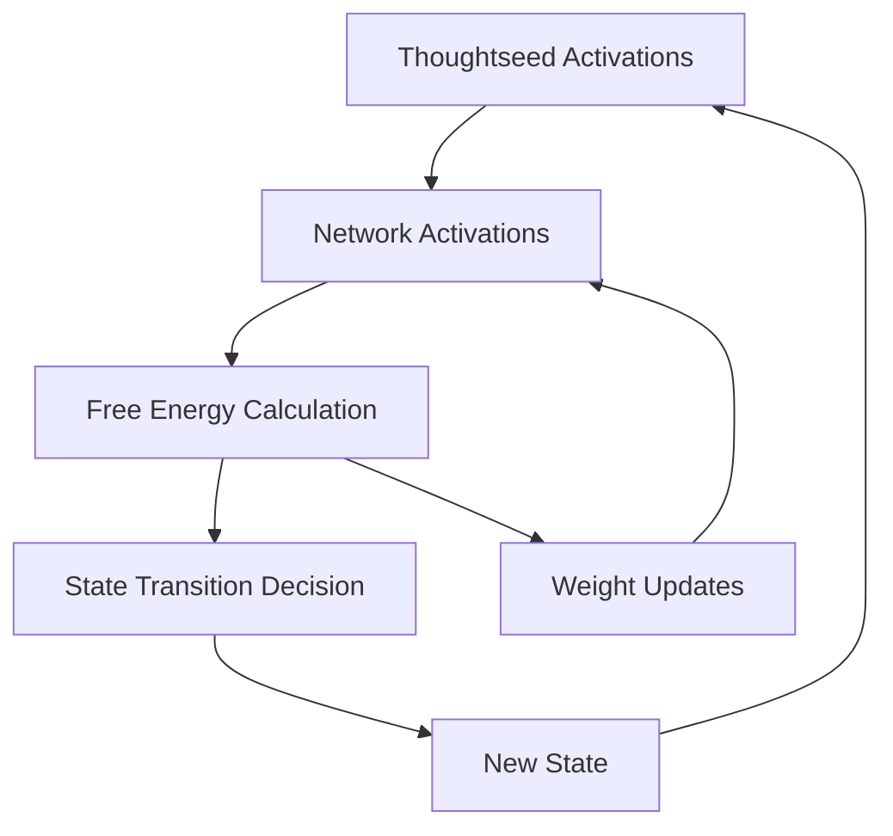

# Free Energy Calculations

## Overview

This document provides comprehensive technical details on how variational free energy and expected free energy are calculated in the meditation simulation framework. These calculations form the core of the Active Inference implementation and drive both learning dynamics and state transitions.

---

## Variational Free Energy Implementation

### Location in Code
- **File**: `act_inf_learner.py`
- **Method**: `ActInfLearner.calculate_free_energy()`
- **Lines**: 332-381

### Theoretical Foundation

The variational free energy is implemented according to **Equation 2** from the theoretical framework:

```
F_t(s) = ∑_k Π_k(ψ_t)[n_k(t) - μ_k(s_t)]² + λ ||W||_F²
```

Where:
- `F_t(s)`: Variational free energy at time t in state s
- `Π_k(ψ_t)`: Precision weighting for network k (depends on meta-awareness ψ)
- `n_k(t)`: Actual network activation for network k at time t
- `μ_k(s_t)`: Expected network activation for network k in state s_t
- `λ`: Complexity penalty parameter
- `||W||_F²`: Frobenius norm of the weight matrix (complexity term)

### Implementation Details

```python
def calculate_free_energy(self, network_acts, current_state, meta_awareness):
    """
    Calculate variational free energy as prediction error plus complexity cost.
    
    Implements Equation 2 from the theoretical framework:
    F_t(s) = ∑_k Π_k(ψ_t)[n_k(t) - μ_k(s_t)]² + λ ||W||_F²
    """
    # Get expected network profile for current state
    expected_profile = self.learned_network_profiles["state_network_expectations"][current_state]
    
    # Calculate prediction error (squared difference)
    prediction_errors = {}
    total_prediction_error = 0
    
    for net in self.networks:
        # Calculate error between actual and expected - implements [n_k(t) - μ_k(s_t)]²
        error = (network_acts[net] - expected_profile[net])**2
        
        # State-specific error adjustments
        if current_state == "mind_wandering" and net == "DMN":
            if self.experience_level == 'expert':
                error *= 0.8  # Lower prediction error for experts
            else:
                error *= 1.2  # Higher prediction error for novices
        
        prediction_errors[net] = error
        
        # Weight error by precision - implements Π_k(ψ_t) scaling
        precision = 0.5 + self.precision_weight * meta_awareness
        weighted_error = error * precision
        total_prediction_error += weighted_error
    
    # Calculate complexity cost - implements λ ||W||_F² term
    complexity_cost = self.complexity_penalty
    
    # Free energy = prediction error + complexity cost
    free_energy = total_prediction_error + complexity_cost
    
    return free_energy, prediction_errors, total_prediction_error
```

### Component Breakdown

#### 1. Prediction Error Term
```python
# Implements: ∑_k Π_k(ψ_t)[n_k(t) - μ_k(s_t)]²
error = (network_acts[net] - expected_profile[net])**2
precision = 0.5 + self.precision_weight * meta_awareness
weighted_error = error * precision
```

**Key Features**:
- Squared error between actual and expected network activations
- Precision weighting increases with meta-awareness
- Experience-level specific adjustments for DMN during mind-wandering

#### 2. Complexity Cost Term
```python
# Implements: λ ||W||_F²
complexity_cost = self.complexity_penalty
```

**Experience-Level Parameters**:
- **Novices**: `λ = 0.4` (higher complexity penalty)
- **Experts**: `λ = 0.2` (lower complexity penalty)

#### 3. Precision Weighting Mechanism
```python
# Implements: Π_k(ψ_t)
precision = 0.5 + self.precision_weight * meta_awareness
```

**Experience-Level Parameters**:
- **Novices**: `precision_weight = 0.4`
- **Experts**: `precision_weight = 0.5`

### State-Specific Adjustments

The implementation includes experience-dependent modifications to prediction errors:

```python
if current_state == "mind_wandering" and net == "DMN":
    if self.experience_level == 'expert':
        error *= 0.8  # 20% reduction in prediction error
    else:
        error *= 1.2  # 20% increase in prediction error
```

This reflects empirical findings that experts have more stable DMN expectations during mind-wandering episodes.

---

## Expected Free Energy and State Transitions

### Location in Code
- **File**: `act_inf_learner.py`
- **Method**: `ActInfLearner.train()` (main training loop)
- **Lines**: 764-856

### Theoretical Foundation

The expected free energy concepts influence state transitions according to **Equation 4**:

```
P(s_{t+1}=s') ∝ exp(-β F_t(s')) × Θ(s_t → s')
```

Where:
- `P(s_{t+1}=s')`: Probability of transitioning to state s'
- `β`: Inverse temperature parameter (precision)
- `F_t(s')`: Free energy of the target state
- `Θ(s_t → s')`: Threshold conditions for state transitions

### Implementation Strategy

The implementation uses free energy to modulate transition probabilities:

```python
# Higher free energy increases transition probability
precision_factor = 1.5 if self.experience_level == 'expert' else 0.8
fe_factor = min(0.3, free_energy * 0.3 * precision_factor)
natural_prob = min(0.95, natural_prob + fe_factor)
```

#### Key Mechanisms:

1. **Free Energy Driven Transitions**: Higher free energy increases transition probability
2. **Experience Modulation**: Experts have higher precision in transition decisions
3. **Threshold Gating**: Transitions must satisfy state-specific thresholds

### Transition Threshold Implementation

```python
# FOCUSED STATES TO MIND WANDERING
if current_state in ["breath_control", "redirect_breath"]:
    distraction_level = (activations[self.thoughtseeds.index("pain_discomfort")] + 
                        activations[self.thoughtseeds.index("pending_tasks")])
    dmn_dan_ratio = network_acts['DMN'] / (network_acts['DAN'] + 0.1)
    
    if (distraction_level > self.transition_thresholds['mind_wandering'] or 
        dmn_dan_ratio > self.transition_thresholds['dmn_dan_ratio']):
        next_state = "mind_wandering"
        natural_transition = True
```

### Threshold Parameters by Experience Level

| State Transition | Novice Threshold | Expert Threshold |
|------------------|------------------|------------------|
| → Mind Wandering | 0.6 (distraction) | 0.7 (distraction) |
| → Meta Awareness | 0.4 (self-reflection) | 0.3 (self-reflection) |
| → Return Focus | 0.3 (focus/equanimity) | 0.25 (focus/equanimity) |
| DMN/DAN Ratio | 0.5 | 0.6 |

---

## Free Energy Tracking and Analysis

### Data Collection

Free energy values are tracked throughout training:

```python
# Record free energy for analysis
self.free_energy_history.append(free_energy)
self.prediction_error_history.append(total_prediction_error)
self.precision_history.append(0.5 + self.precision_weight * meta_awareness)
```

### State-Specific Free Energy Analysis

The system calculates average free energy by state:

```python
'average_free_energy_by_state': {
    state: float(np.mean([
        self.free_energy_history[j]
        for j, s in enumerate(self.state_history) if s == state
    ])) for state in self.states if any(s == state for s in self.state_history)
}
```

### Typical Free Energy Values

Based on simulations, typical free energy ranges are:

| State | Novice FE Range | Expert FE Range |
|-------|----------------|----------------|
| Breath Control | 1.2 - 1.8 | 0.8 - 1.2 |
| Mind Wandering | 2.0 - 3.0 | 1.5 - 2.2 |
| Meta Awareness | 1.0 - 1.5 | 0.7 - 1.1 |
| Redirect Breath | 1.1 - 1.6 | 0.8 - 1.3 |

---

## Learning Dynamics and Free Energy

### Weight Update Mechanism

The system learns network profiles to minimize prediction errors (Equation 3):

```python
def update_network_profiles(self, thoughtseed_activations, network_activations, 
                           current_state, prediction_errors):
    """
    Update learned network profiles based on prediction errors.
    
    Implements Equation 3: W_ik ← (1-ρ)W_ik + η δ_k(t)z_i(t)
    """
    for i, ts in enumerate(self.thoughtseeds):
        ts_act = thoughtseed_activations[i]  # z_i(t)
        
        if ts_act > 0.2:  # Only update when thoughtseed is active
            for net in self.networks:
                current_error = prediction_errors[net]  # δ_k(t)
                
                # Bayesian-inspired update
                error_sign = 1 if network_activations[net] < expected[net] else -1
                update = self.learning_rate * (error_sign * current_error) * ts_act / precision
                
                # Apply weight update
                self.learned_network_profiles["thoughtseed_contributions"][ts][net] += update
```

### Learning Rate Parameters

- **Novices**: `learning_rate = 0.01` (slower adaptation)
- **Experts**: `learning_rate = 0.02` (faster adaptation)

---

## Integration with Network Dynamics

Free energy calculations are tightly coupled with network activation computations:

1. **Network Activations** → **Free Energy Calculation**
2. **Free Energy** → **State Transition Probability**
3. **Prediction Errors** → **Weight Updates**
4. **Updated Weights** → **Modified Network Activations**

This creates a closed-loop system where free energy minimization drives both learning and behavior.

### Computational Flow



---

## Biological Plausibility

### Noise and Stochasticity

The implementation includes biological noise:

```python
# Add noise for biological plausibility
network_acts[net] += np.random.normal(0, self.noise_level)
```

**Noise Levels**:
- **Novices**: `noise_level = 0.06`
- **Experts**: `noise_level = 0.03`

### Memory Factors

Temporal smoothing reflects neural inertia:

```python
if hasattr(self, 'prev_network_acts') and self.prev_network_acts:
    for net in self.networks:
        network_acts[net] = (self.memory_factor * self.prev_network_acts[net] + 
                            (1 - self.memory_factor) * network_acts[net])
```

**Memory Parameters**:
- **Novices**: `memory_factor = 0.7`
- **Experts**: `memory_factor = 0.85`

---

## Validation and Debugging

### Free Energy Bounds Checking

The implementation includes validation for reasonable free energy values:

```python
# Typical ranges for validation
assert 0.5 <= free_energy <= 5.0, f"Free energy out of bounds: {free_energy}"
```

### Experience-Level Validation

Key patterns that should emerge:

1. **Experts have lower average free energy** across all states
2. **Experts show more stable free energy trajectories** (lower variance)
3. **Free energy peaks during state transitions** for both groups
4. **Mind-wandering shows highest free energy** for both groups

---

## Future Enhancements

### Hierarchical Free Energy

Future implementations could include:

1. **Multi-scale free energy**: Separate calculations for each hierarchical level
2. **Context-dependent precision**: Dynamic precision weighting based on meditation progress
3. **Predictive coding**: Full implementation of hierarchical predictive processing

### Advanced Bayesian Updates

Enhanced learning mechanisms:

1. **Variational message passing**: More sophisticated belief updates
2. **Hierarchical Bayesian inference**: Multi-level parameter learning
3. **Active learning**: Exploration-exploitation tradeoffs in attention allocation

---

*This documentation reflects the current implementation of free energy principles in the meditation simulation framework. The calculations form the theoretical foundation for modeling expert-novice differences in contemplative practice.*
